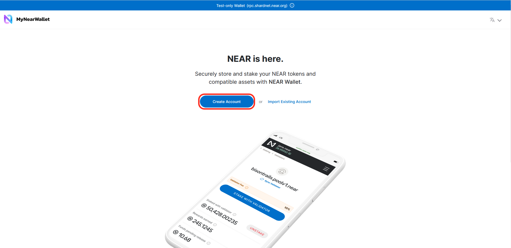
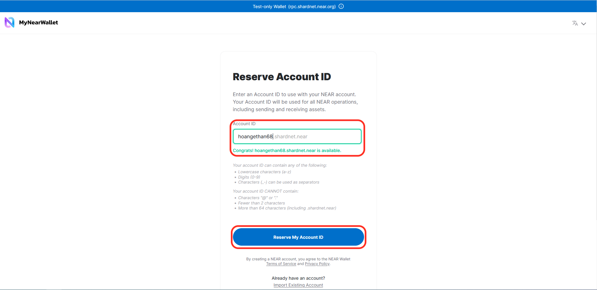
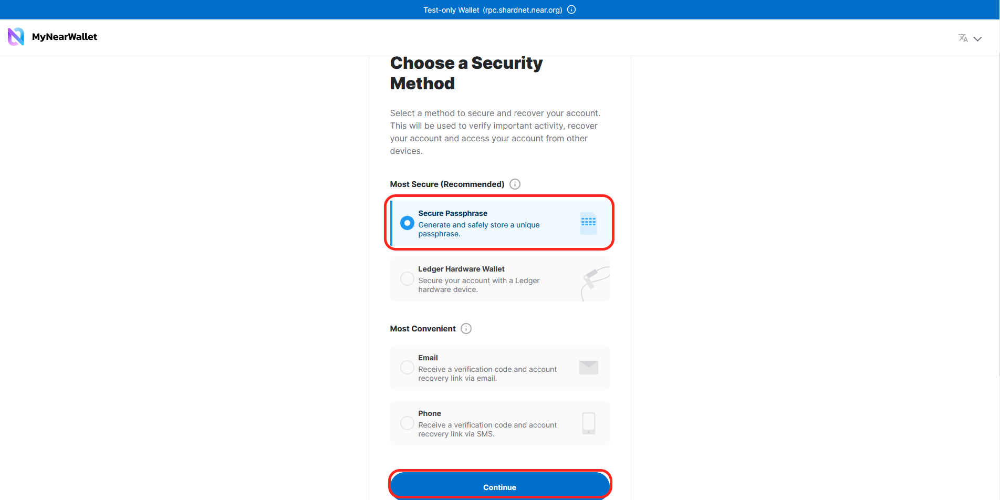
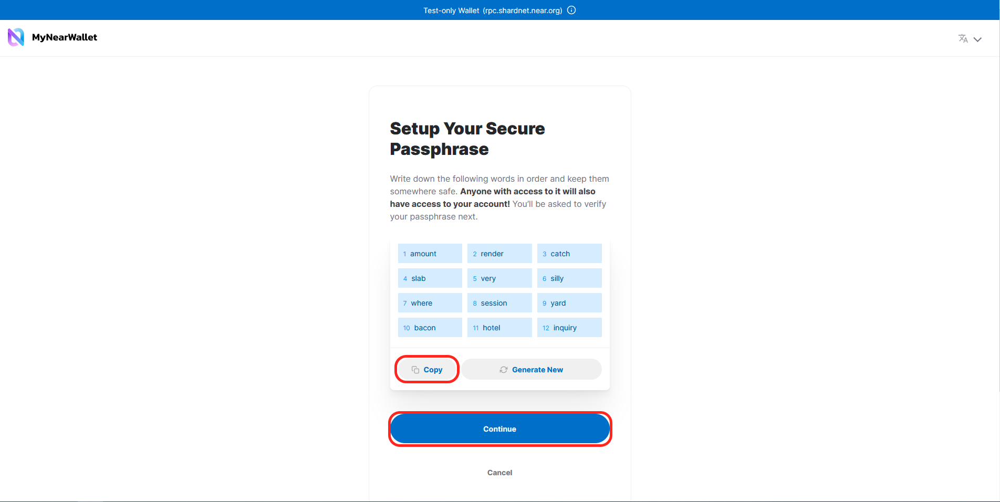
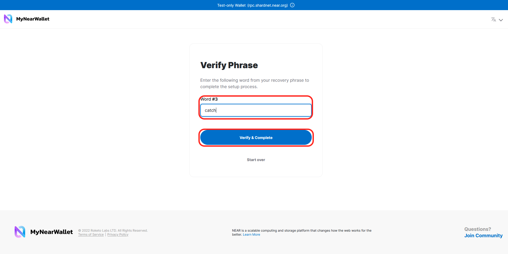

Truy cập https://wallet.shardnet.near.org/

Kích chọn "Create Account"

Nhập tên tài khoản mà bạn muốn tạo. Sau đó kích "Reserve My Account ID"

Chọn phương thức bảo mật "Secure Passphrase". Tiếp theo kích "Continue"

Trên màn hình sẽ hiện cụm từ 12 ký tự bảo mật. Các bạn lưu 12 ký tự này lại và kích chọn "Continue"

Tìm từ khoá theo đúng yêu cầu trong 12 ký tự vừa lưu ở bước trên nhập vào để xác thực cụm từ khoá bảo mật. Trong ví dụ mình đang thực hiện ký tự yêu cầu là ký tự thứ 3 "catch". Nhập "catch" vào ô và kích chọn "Verify & Complete"

Như vậy các bạn đã tạo xong ví Shardnet. Tiếp theo chúng ta sẽ tiến hành cài đặt node.
