## Chuẩn bị VPS (VPS Google Cloud)
Các bạn chuẩn bị 01 VPS có cấu hình theo yêu cầu của bên Near:


| Hardware       | Chunk-Only Producer  Specifications                                   |
| -------------- | ---------------------------------------------------------------       |
| CPU            | 4-Core CPU with AVX support                                           |
| RAM            | 8GB DDR4                                                              |
| Storage        | 500GB SSD                                                             |

Cài đặt hệ điều hành ubuntu 20.04 LTS.

Google Cloud đang có chương trình dùng thử cho khách hàng mới, bạn sẽ nhận được khoản tín dụng 300 USD để sử dụng trong 3 tháng. Nên trong bài viết này mình hướng dẫn các bạn cài đặt Node Near trên Google Cloud. Như vậy đã SSH được tới VPS của Google Cloud.

## Cài đặt NEAR-CLI

Để SSH vào VPS của Google Cloud các bạn vào Console của Google Cloud, kích vào mũi tên xuống bên cạnh chữ "SSH" chọn "Open in browser window" sẽ có một cửa sổ trình duyệt mở ra. 

#### Kiểm tra VPS của bạn có phù hợp với yêu cầu của Near

```
lscpu | grep -P '(?=.*avx )(?=.*sse4.2 )(?=.*cx16 )(?=.*popcnt )' > /dev/null \
  && echo "Supported" \
  || echo "Not supported"
```
> Supported

Nếu VPS của bạn hiểu thị "Supported" là ok.

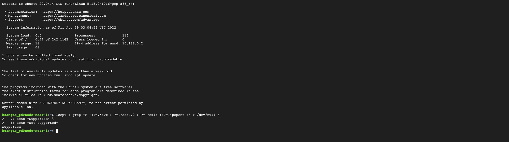

#### Cập nhật VPS

```
sudo apt update && sudo apt upgrade -y
```
#### Cài đặt Node.js and npm

```
curl -sL https://deb.nodesource.com/setup_18.x | sudo -E bash -  
sudo apt install build-essential nodejs
PATH="$PATH"
```
Khi được hỏi "Do you want to continue? [Y/n]", bạn chọn Y và Enter để tiếp tục

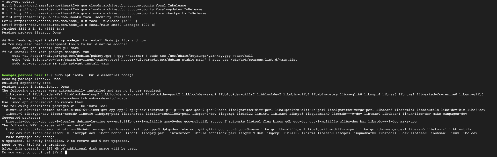

#### Kiểm tra phiên bản Node.js và npm
```
node -v
```

```
npm -v
```
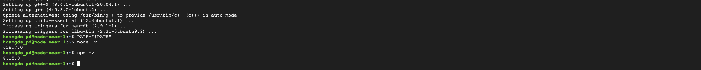

#### Cài đặt NEAR-CLI

```
sudo npm install -g near-cli
```
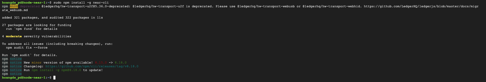

Thiết lập môi trường thử nghiệm

```
export NEAR_ENV=shardnet
```
```
echo 'export NEAR_ENV=shardnet' >> ~/.bashrc
echo 'export NEAR_ENV=shardnet' >> ~/.bash_profile
source $HOME/.bash_profile
```
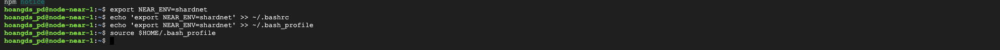

Để kiểm tra xem Near CLI đã hoạt động chưa bạn thực hiện lệnh
```
near proposals
```
Kết quả hiển như các địa chỉ pool như trong ảnh là ok

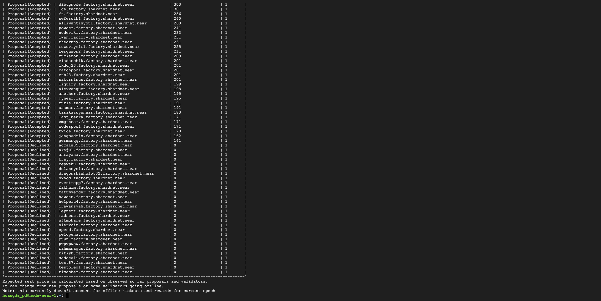

## Triển khai Node Near
#### Cài đặt các công cụ của nhà phát triển

```
sudo apt install -y git binutils-dev libcurl4-openssl-dev zlib1g-dev libdw-dev libiberty-dev cmake gcc g++ python3 docker.io protobuf-compiler libssl-dev pkg-config clang llvm cargo
```
#### Cài đặt Python pip

```
sudo apt install python3-pip
```
Khi được hỏi "Do you want to continue? [Y/n]", bạn chọn Y và Enter để tiếp tục

#### Thiết lập cấu hình

```
USER_BASE_BIN=$(python3 -m site --user-base)/bin
export PATH="$USER_BASE_BIN:$PATH"
```
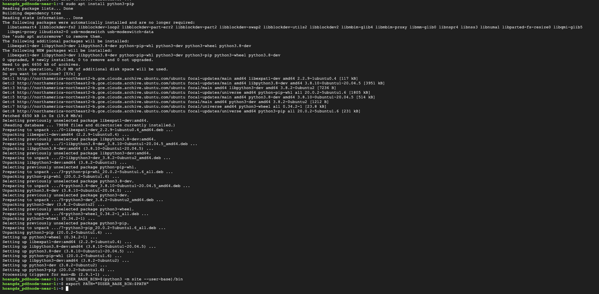

#### Cài đặt Building env
```
sudo apt install clang build-essential make
```
#### Cài đặt Rust & Cargo
```
curl --proto '=https' --tlsv1.2 -sSf https://sh.rustup.rs | sh
```
Nếu bạn thấy thông báo lỗi, gõ Y và Enter để tiếp tục.

Sau đó gõ 1 và Enter để tiếp tục cài đặt.

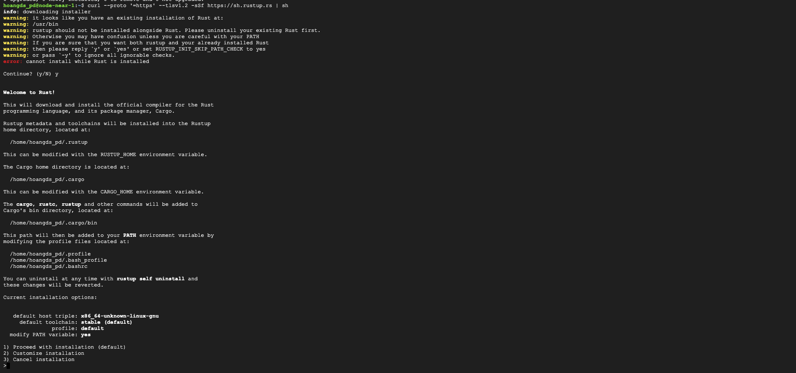

#### Tạo môi trường
```
source $HOME/.cargo/env
```
#### Tạo bản sao Nearcore từ GitHub
```
git clone https://github.com/near/nearcore
cd nearcore
git fetch
```
#### Kiểm tra commit

Mã commit sẽ thay đổi theo thời gian. Các bạn lấy mã commit [tại đây](https://github.com/near/stakewars-iii/blob/main/commit.md).
```
git checkout <commit>
```
Thay <commit> bằng mã được lấy trong file ở trên

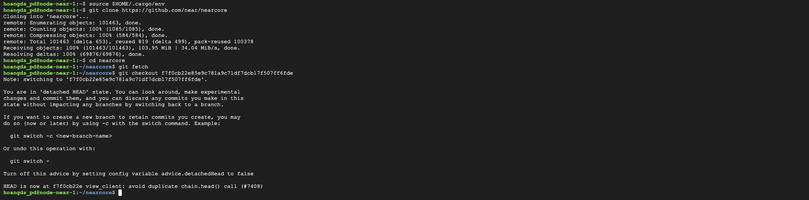

#### Biên dịch Nearcore

Trong thư mục nearcore các bạn chạy lệnh
```
cargo build -p neard --release --features shardnet
```
Quá trình này mất khoảng 10 phút, thời gian phụ thuộc vào cấu hình VPS

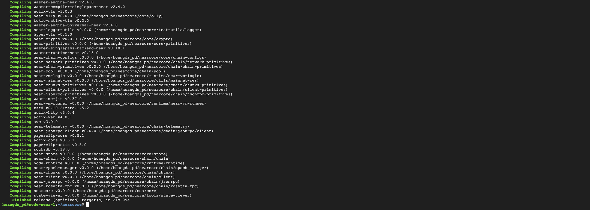

#### Tạo thư mực làm việc

Trong thư mục nearcore các bạn chạy lệnh
```
./target/release/neard --home ~/.near init --chain-id shardnet --download-genesis
```
  

#### Thay đổi file config.json
  
```
rm ~/.near/config.json
wget -O ~/.near/config.json https://s3-us-west-1.amazonaws.com/build.nearprotocol.com/nearcore-deploy/shardnet/config.json
```
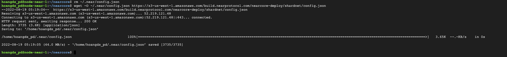
  
#### Khởi chạy Node
  
Trong thư mục nearcore các bạn chạy lệnh
  
```
cd ~/nearcore
./target/release/neard --home ~/.near run
```

  
VPS đang tiến hành đồng bộ, các bạn để VPS tự chạy cho đến khi Headers tải đạt 100%. Việc này có thể mất hơn 1 giờ.
