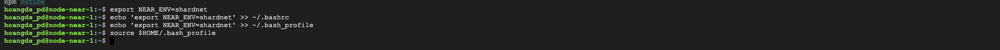

## Mua VPS (VPS Google Cloud)
Bạn mua 01 VPS có cấu hình theo yêu cầu của bên Near:

| Hardware       | Chunk-Only Producer  Specifications                                   |
| -------------- | ---------------------------------------------------------------       |
| CPU            | 4-Core CPU with AVX support                                           |
| RAM            | 8GB DDR4                                                              |
| Storage        | 500GB SSD                                                             |

Cài đặt hệ điều hành ubuntu 20.04 LTS.

Google Cloud đang có chương trình dùng thử cho khách hàng mới, bạn sẽ nhận được khoản tín dụng 300 USD để sử dụng trong 3 tháng. Nên trong bài viết này mình hướng dẫn các bạn cài đặt Node Near trên Google Cloud để tận dụng khoản tín dụng này.

Cấu hình mình sử dụng là 4 vCPU, 16GB Ram, 500GB SSD, vùng có ký hiệu Low CO2 (chọn ở khu vực này giá sẽ rẻ hơn các khu vực khác). Cấu hình này chạy Node sẽ ổn định hơn là cấu hình bên Near yêu cầu. Giá VPS là hơn 200 USD/tháng.

Bạn truy cập vào console của Google Cloud, kích vào dấu 3 gạch, chọn Compute Engine, chọn VM instances.


Kích vào "Create instance" để khởi tạo vps.


Bạn điền tên vps lựa chọn các thông số vps sau đó kích "CREATE" để khởi tạo vps.

Sau khi khởi tạo xong vps bạn sẽ được chuyển đến trang Console của Google Cloud. Để SSH vào VPS thực hiện lệnh cài đặt, bạn kích vào mũi tên xuống bên cạnh chữ "SSH" chọn "Open in browser window" sẽ có một cửa sổ trình duyệt mở ra. Bạn đã có thế bắt đầu thực hiện cách lệnh cài đặt ở trên cửa sổ trình duyệt mới.


## Cài đặt NEAR-CLI

#### Kiểm tra VPS của bạn có phù hợp với yêu cầu của Near

```
lscpu | grep -P '(?=.*avx )(?=.*sse4.2 )(?=.*cx16 )(?=.*popcnt )' > /dev/null \
  && echo "Supported" \
  || echo "Not supported"
```
> Supported

Nếu VPS của bạn hiểu thị "Supported" là ok.


#### Cập nhật VPS

```
sudo apt update && sudo apt upgrade -y
```
#### Cài đặt Node.js and npm

```
curl -sL https://deb.nodesource.com/setup_18.x | sudo -E bash -  
```
```
sudo apt install build-essential nodejs
```
Khi được hỏi "Do you want to continue? [Y/n]", bạn nhấn Y và Enter để tiếp tục.


```
PATH="$PATH"
```

#### Kiểm tra phiên bản Node.js và npm
```
node -v
```

```
npm -v
```


#### Cài đặt NEAR-CLI

```
sudo npm install -g near-cli
```


Update phiên bản của Near-Cli


Thiết lập môi trường thử nghiệm

```
export NEAR_ENV=shardnet
```
```
echo 'export NEAR_ENV=shardnet' >> ~/.bashrc
echo 'export NEAR_ENV=shardnet' >> ~/.bash_profile
source $HOME/.bash_profile
```


Để kiểm tra xem Near CLI đã hoạt động chưa bạn thực hiện lệnh.
```
near proposals
```
Kết quả hiển như các địa chỉ như trong ảnh là ok.


## Triển khai Node Near
#### Cài đặt các công cụ của nhà phát triển

```
sudo apt install -y git binutils-dev libcurl4-openssl-dev zlib1g-dev libdw-dev libiberty-dev cmake gcc g++ python3 docker.io protobuf-compiler libssl-dev pkg-config clang llvm cargo
```
#### Cài đặt Python pip

```
sudo apt install python3-pip
```
Khi được hỏi "Do you want to continue? [Y/n]", bạn bấm Y và Enter để tiếp tục

#### Thiết lập cấu hình

```
USER_BASE_BIN=$(python3 -m site --user-base)/bin
export PATH="$USER_BASE_BIN:$PATH"
```


#### Cài đặt Building env
```
sudo apt install clang build-essential make
```
#### Cài đặt Rust & Cargo
```
curl --proto '=https' --tlsv1.2 -sSf https://sh.rustup.rs | sh
```
Nếu bạn thấy thông báo lỗi, gõ Y và Enter để tiếp tục.

Sau đó gõ 1 và Enter để tiếp tục cài đặt.


#### Tạo môi trường
```
source $HOME/.cargo/env
```
#### Clone Nearcore từ GitHub
```
git clone https://github.com/near/nearcore
cd nearcore
git fetch
```
#### Kiểm tra commit

Mã commit sẽ thay đổi theo thời gian. Các bạn lấy mã commit [tại đây](https://github.com/near/stakewars-iii/blob/main/commit.md).
```
git checkout <commit>
```


#### Biên dịch Nearcore

Trong thư mục nearcore các bạn chạy lệnh.
```
cargo build -p neard --release --features shardnet
```
Quá trình này mất khoảng 10 - 20 phút, thời gian phụ thuộc vào cấu hình VPS


#### Tạo thư mục làm việc

Trong thư mục nearcore các bạn chạy lệnh.
```
./target/release/neard --home ~/.near init --chain-id shardnet --download-genesis
```
  

#### Tạo file config.json
  
```
rm ~/.near/config.json
```
```
wget -O ~/.near/config.json https://s3-us-west-1.amazonaws.com/build.nearprotocol.com/nearcore-deploy/shardnet/config.json
```

  
#### Khởi chạy Node
  
Trong thư mục nearcore các bạn chạy lệnh.
  
```
cd ~/nearcore
```
```
./target/release/neard --home ~/.near run
```

  
VPS đang tiến hành đồng bộ, các bạn để VPS tự chạy cho đến khi Headers tải đạt 100%. Việc này có thể mất hơn 1 giờ.

## Kết nối ví Shardnet với Node Near

Sau khi Headers tải đạt 100% các bạn nhấm phím Ctrl + Z để thoát lệnh. Sau đó chạy lệnh

```
near login
```
Bạn sẽ được hỏi "Would you like to opt in (y/n)?" Bạn nhấn y và Enter để tiếp tục.


Copy link và mở trong trình duyệt đã tạo ví Shardnet trước đó


Chọn ví mà bạn muốn kết nối sau đó kích chọn "Next"


Kích chọn "Connect" để xác nhận quyền truy cập


Nhập địa chỉ ví và kích chọn "Confirm"


Sau đó có một màn hình lỗi xuất hiện trên trình duyệt


Bạn quay tab trình duyệt ssh tới vps, nhập lại địa chỉ ví và nhấn enter. Màn hình xuất hiện như hình dưới là đã kết nối thành công.


### Tạo file validator_key.json

```
cat ~/.near/validator_key.json
```
> cat: /home/hoangds_pd/.near/validator_key.json: No such file or directory

Chưa có file validator nên chúng ta tiến hành tạo file

```
near generate-key <pool_id>
```
Trong đó <pool_id> sẽ là: xxxx.factory.shardnet.near. xxxx là tên ví shardnet của các bạn.

```
cp ~/.near-credentials/shardnet/YOUR_WALLET.json ~/.near/validator_key.json
```
Trong đó YOUR_WALLET.json sẽ là: xxxx.shardnet.near. xxxx là tên ví shardnet của các bạn.


### Chỉnh sửa file validator_key.json

```
nano ~/.near/validator_key.json
```
* Sửa ```private_key``` thành ```secret_key```
* Đổi ```<account_id>``` thành xxxx.factory.shardnet.near. xxxx là tên ví shardnet của các bạn


Sau đó bạn nhấn Ctr + O và Enter để lưu. Nhấn Ctrl + X để thoát.

### Chỉnh sửa file config.json

Theo thông báo ngày 12/8/2022 trên discord của dự án. Các bạn cần thay đổi file config.json như sau

Tìm “public_key” trong file  node_key.json

```
cat ~/.near/node_key.json
```


Chỉnh sửa file config.json

```
nano ~/.near/config.json
```

Bạn thêm ```"public_addrs": ["<public key>@<public IP>:24567"],``` vào sau đoạn

  "network": {
  
  "addr": "0.0.0.0:24567",
  
  "boot_nodes": "ed25519:2p3oWc....
  
  "whitelist_nodes": "",
  
* ```<public key>``` là public key bạn lấy trong file node_key.json ở trên
* ```<public IP>``` là địa chỉ ip vps của bạn


Bạn nhấn Ctrl + O và Enter để lưu file lại. Nhấn Ctrl + X để thoát ra.

### Tạo file service để giữ cho Node Near luôn chạy

```
sudo nano /etc/systemd/system/neard.service
```

Copy và paste đoạn dưới đây vào file

```
[Unit]
Description=NEARd Daemon Service

[Service]
Type=simple
User=<USER>
#Group=near
WorkingDirectory=/home/<USER>/.near
ExecStart=/home/<USER>/nearcore/target/release/neard run
Restart=on-failure
RestartSec=30
KillSignal=SIGINT
TimeoutStopSec=45
KillMode=mixed

[Install]
WantedBy=multi-user.target
```
Trong đó ```<USER>``` là tên người dùng của vps của bạn


  
Sau đó bạn nhấn Ctr + O và Enter để lưu. Nhấn Ctrl + X để thoát


  
### Khởi chạy Node Near
  
```
sudo systemctl enable neard
```
```
sudo systemctl start neard
```

Kiểm tra logs
  
```
journalctl -n 100 -f -u neard
```

Nếu bạn thấy lỗi không thể khởi chạy Neard. Khởi động lại VPS bằng cách chạy lệnh
  
```
sudo reboot
```

Sau đó start Neard và tiếp tục kiểm tra logs. Nếu logs hiển thị như ảnh là thành công!
  
```
sudo systemctl start neard
```
  
```
journalctl -n 100 -f -u neard
```


#### Như vậy bạn đã hoàn thành việc cài đặt Node Near và hoàn thành thử thách 1 và 2 của chương trình. Bạn sẽ nhận được số điểm là 30 UNP.

#### Chuyển Tới Triển Khai Staking Pool 🚀
[Triển khai Staking Pool](./03-Trien-Khai-Staking-Pool.md)
