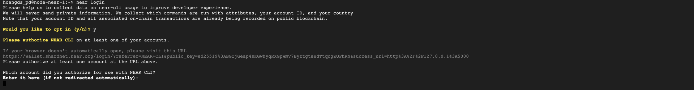
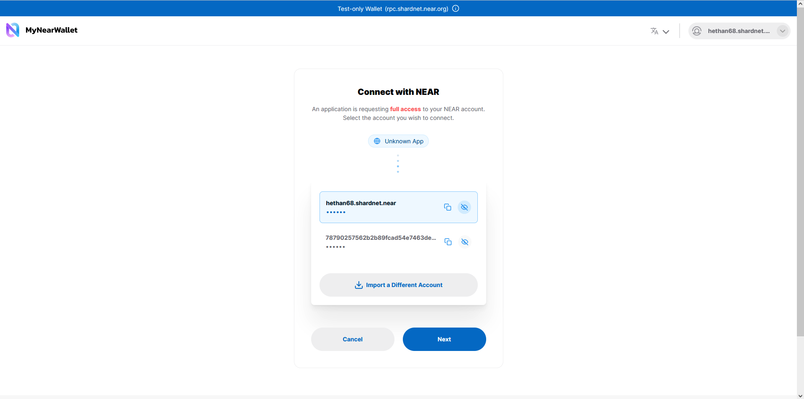
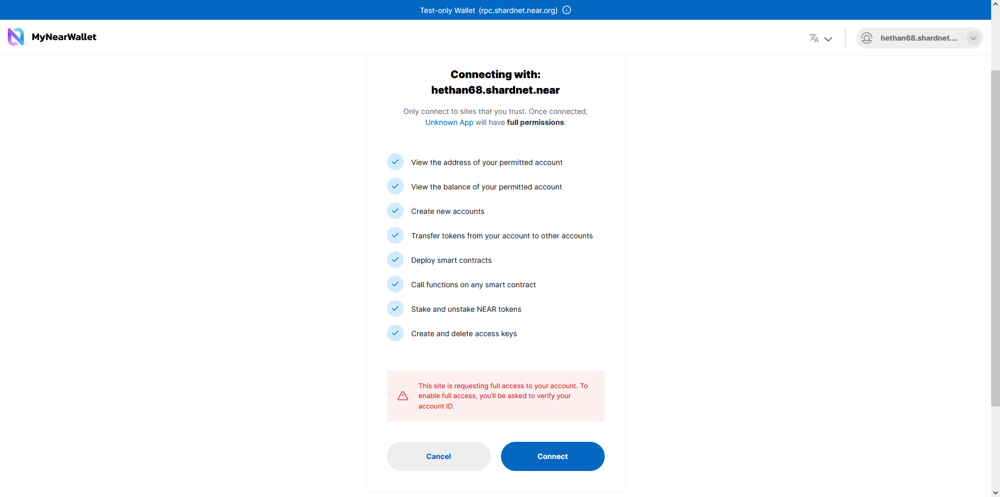
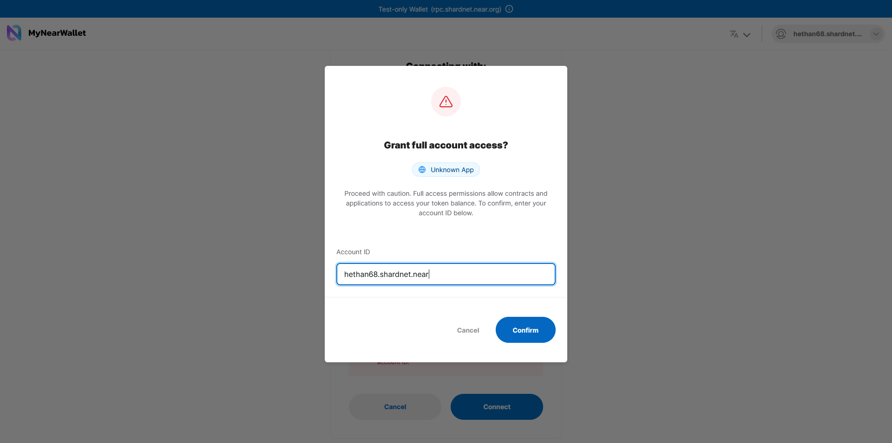
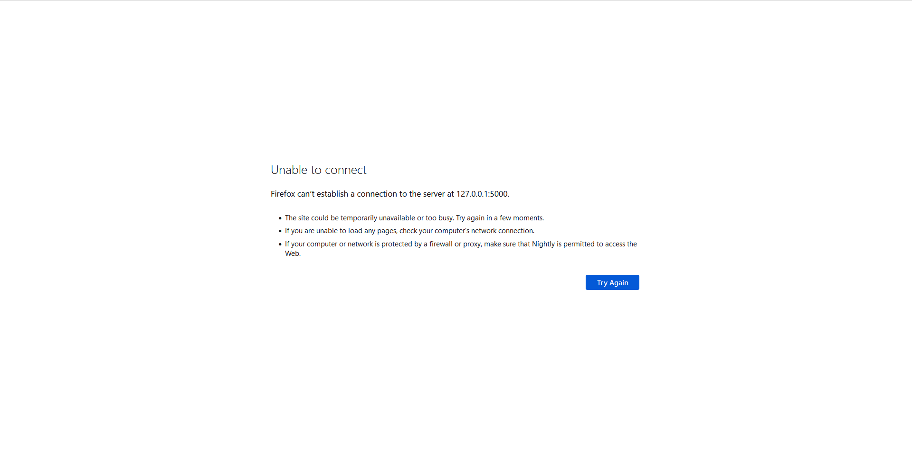
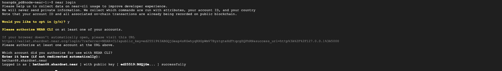
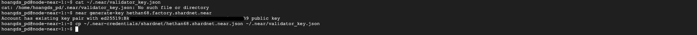
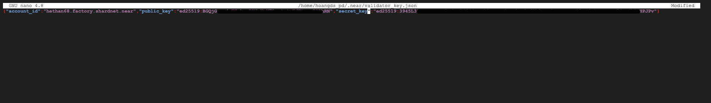
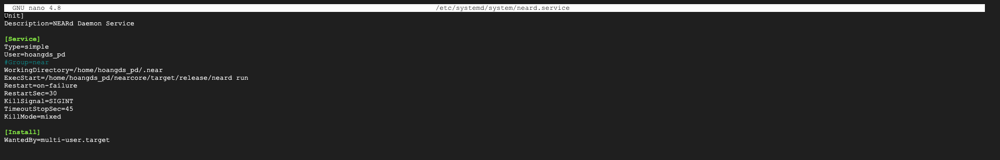

### Kết nối ví Shardnet với Node Near

Sau khi Headers tải đạt 100% các bạn nhấm phím Ctrl + Z để thoát lệnh. Sau đó chạy lệnh

```
near login
```
Bạn sẽ được hỏi Would you like to opt in (y/n)? Bạn gõ y và enter để tiếp tục



Copy link và mở trong trình duyệt đã tạo ví Shardnet trước đó



Chọn ví mà bạn muốn kết nối sau đó kích chọn "Next"



Kích chọn "Connect" để xác nhận quyền truy cập



Nhập địa chỉ ví và kích chọn "Confirm"



Sau đó có một màn hình lỗi xuất hiện. Bạn quay lại trình ssh tới vps, nhập lại địa chỉ ví và nhấn enter. Màn hình xuất hiện như hình dưới là đã kết nối thành công.



### Cấu hình validator key

```
cat ~/.near/validator_key.json
```
> cat: /home/hoangds_pd/.near/validator_key.json: No such file or directory

Chưa có file validator nên chúng ta tiến hành tạo file

```
near generate-key <pool_id>
```
Trong đó <pool_id> sẽ là: xxxx.factory.shardnet.near. xxxx là tên ví shardnet của các bạn.

```
cp ~/.near-credentials/shardnet/YOUR_WALLET.json ~/.near/validator_key.json
```
Trong đó YOUR_WALLET.json sẽ là: xxxx.shardnet.near. xxxx là tên ví shardnet của các bạn.



### Sau đó chỉnh sửa lại file validator_key.json

```
nano ~/.near/validator_key.json
```
* Sửa private_key thành secret_key
* Đổi <account_id> thành xxxx.factory.shardnet.near. xxxx là tên ví shardnet của các bạn



Sau đó bạn nhấn Ctr + O và enter để lưu. Nhấn Ctrl + X để thoát

### Tạo file service để giữ cho Node Near luôn chạy

```
sudo nano /etc/systemd/system/neard.service
```

Copy và paste đoạn dưới đây vào file

```
[Unit]
Description=NEARd Daemon Service

[Service]
Type=simple
User=<USER>
#Group=near
WorkingDirectory=/home/<USER>/.near
ExecStart=/home/<USER>/nearcore/target/release/neard run
Restart=on-failure
RestartSec=30
KillSignal=SIGINT
TimeoutStopSec=45
KillMode=mixed

[Install]
WantedBy=multi-user.target
```
Trong đó <USER> là tên người dùng của vps của bạn


  
Sau đó bạn nhấn Ctr + O và enter để lưu. Nhấn Ctrl + X để thoát

