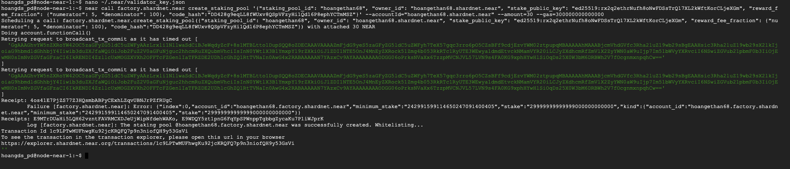
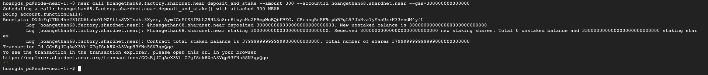
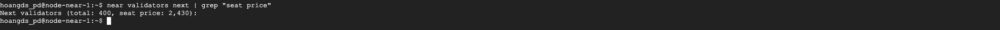

### Triển khai Staking Pool

Khởi tạo một Staking Pool mới cho trình xác thực của bạn bằng cách chạy lệnh sau
```
near call factory.shardnet.near create_staking_pool '{"staking_pool_id": "<pool name>", "owner_id": "<accountId>", "stake_public_key": "<public key>", "reward_fee_fraction": {"numerator": 5, "denominator": 100}, "code_hash":"DD428g9eqLL8fWUxv8QSpVFzyHi1Qd16P8ephYCTmMSZ"}' --accountId="<accountId>" --amount=30 --gas=300000000000000
```

* Thay ```<pool name>``` là pool name của bạn, ví dụ: hoanghethan68
* Thay ```<accountId>``` là xxxx.shardnet.near. xxxx là địa chỉ ví của bạn
* Thay ```<public key>``` là public key được lấy trong file validator_key.json

Truy cập file validator_key.json để lấy public key
```
nano ~/.near/validator_key.json
```
  
Nếu kết quả hiển thị "The staking pool xxxx.factory.shardnet.near was successfully created" có nghĩa là bạn đã tạo thành công Staking Pool của mình.
  


Mỗi lần tạo staking pool bạn sẽ bị trừ 30 near trong ví.
  
Vì RPC của near có lúc sẽ quá tải gây ra tình trạng tạo staking pool lỗi. Nếu tạo lỗi bạn tạo lại bằng lệnh phía trên.

### Stake NEAR

near call <pool_id> deposit_and_stake --amount <amount> --accountId <accountId> --gas=300000000000000

* Thay ```<pool_id>``` bằng xxxx.factory.shardnet.near. xxxx là địa chỉ ví của bạn
* Thay ```<amount>``` bằng số lượng near bạn muốn stake
* Thay ```<accountId>``` bằng xxxx.shardnet.near. xxxx là địa chỉ ví của bạn
  

  
### Trở thành trình xác thực Validator
  
Để trở thành trình xác thực Validator bạn cần stake một số lượng Near trên mạng shardnet vào Staking pool của mình. Số lượng Near sẽ thay đổi theo từng Epoch.

Để kiểm tra số lượng Near cần stake bạn thực hiên lệnh
  
```
near validators next | grep "seat price"
```


  
Seat price = 2,430 thời điểm hiện tại bạn cần stake tối thiểu 2,430 Near

Do có quá nhiều account cheat số NEAR mạng test này nên team dev đã thay đổi quy trình, bây giờ bạn cần vào Discord của NEAR #stake-war phần #stake-wars-tokens_delegation. Gửi địa chỉ ví shardnet cùng pool id của bạn ở channel và chờ team sẽ gửi đủ số NEAR vào validator của bạn.
  
Sau khi có Near trong ví bạn thực hiện stake Near vào staking pool của mình bằng cách ở trên. 

### Hướng dẫn một số lệnh giao dịch

#### Unstake NEAR
  
```
near call <pool_id> unstake '{"amount": "<amount yoctoNEAR>"}' --accountId <accountId> --gas=300000000000000
```
* Thay ```<pool_id>``` là xxxx.factory.shardnet.near. xxxx là địa chỉ ví của bạn
* Thay ```<amount yoctoNEAR>``` bằng số lượng near bạn muốn stake
* Thay ```<accountId>``` bằng xxxx.shardnet.near. xxxx là địa chỉ ví của bạn
 
Unstake tất cả
```
near call <pool_id> unstake_all --accountId <accountId> --gas=300000000000000
```

#### Withdraw

Sau khi unstake thành công bạn cần chờ 2-3 epochs để hoàn thành việc unstake. Sau khi hoàn thành bạn có thể withdraw về ví mình bằng lệnh
```
near call <pool_id> withdraw '{"amount": "<amount yoctoNEAR>"}' --accountId <accountId> --gas=300000000000000
```

Withdraw tất cả

```
near call <pool_id> withdraw_all --accountId <accountId> --gas=300000000000000
```

#### Ping
  
Một ping đưa ra một đề xuất mới và cập nhật số dư đặt cược cho người ủy quyền của bạn. Một ping nên được phát hành mỗi kỷ nguyên để cập nhật phần thưởng được báo cáo.

```
near call <pool_id> ping '{}' --accountId <accountId> --gas=300000000000000
```

Tổng số dư
  
```
near view <pool_id> get_account_total_balance '{"account_id": "<accountId>"}'
```
  
#### Số lượng đã stake

```
near view <pool_id> get_account_staked_balance '{"account_id": "<accountId>"}'
```

#### Số lượng đã unstake
  
```
near view <pool_id> get_account_unstaked_balance '{"account_id": "<accountId>"}'
```

#### Số lượng sẵn sàng để Withdrawal
  
```
near view <pool_id> is_account_unstaked_balance_available '{"account_id": "<accountId>"}'
```
  
#### Pause / Resume Staking

Pause
```
near call <pool_id> pause_staking '{}' --accountId <accountId>
```
Resume
```
near call <pool_id> resume_staking '{}' --accountId <accountId>
```

#### Như vậy bạn đã hoàn thành việc cài đặt Node Near và hoàn thành thử thách 1 và 2 của chương trình. Bạn sẽ nhận được số điểm là 30 UNP.

#### Chuyển Tới Triển Khai Staking Pool 🚀
[Triển khai Staking Pool](./03-Trien-Khai-Staking-Pool.md)
