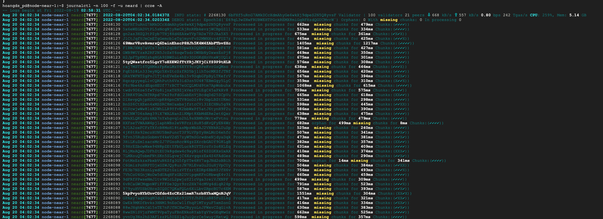
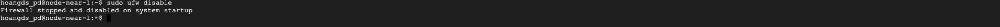
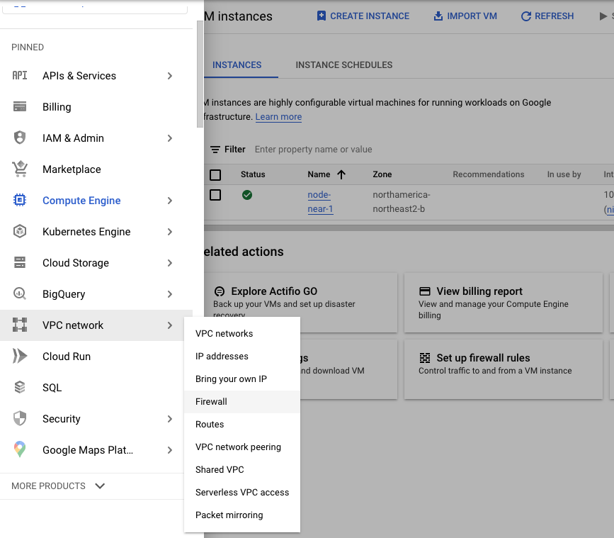
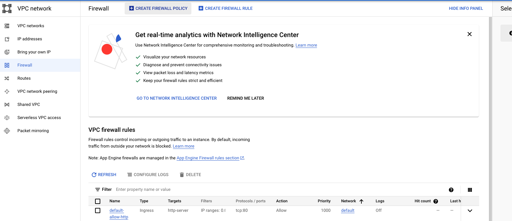
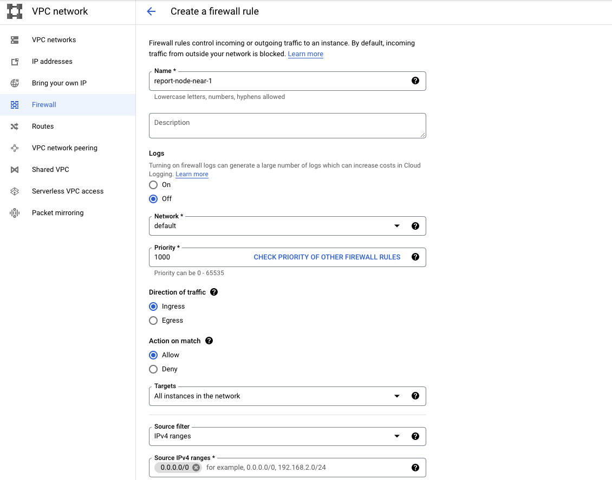
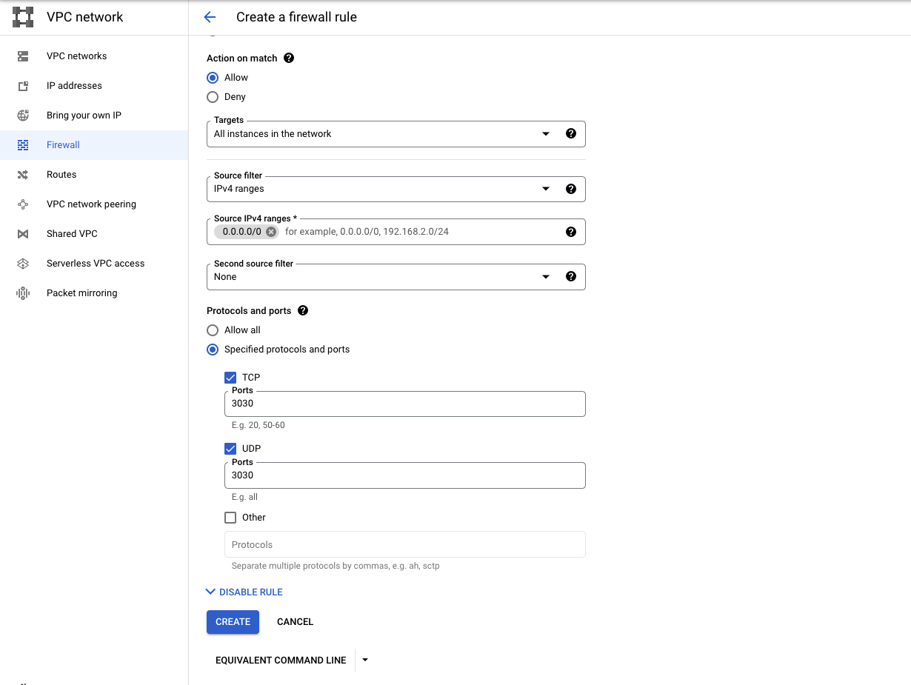

### Theo dõi trạng thái của node qua lệnh trên vps

Xem lịch sử chạy của node một cách trực quan (có màu sắc) bạn cài đặt thêm công cụ CCZE

```
sudo apt install ccze
```

Xem lịch sử chạy của node

```
journalctl -n 100 -f -u neard | ccze -A
```



### Theo dõi trạng thái của node trên website

Cài đặt

```
sudo apt install curl jq
```

Kiểm tra

```
curl -s http://127.0.0.1:3030/status | jq .version
```

Để theo dõi trạng thái của nên trên website chúng ta cần mở port 3030. Google Cloud có hệ thống firewall được quản lý trên console nên việc sử dụng firewall trên vps là không cần thiết. Vì vậy đầu tiên các bạn tắt firewall mặc định của vps sau đó sẽ mở port trên firewall của Google Cloud.

#### Tắt firewall trên vps

```
sudo ufw disable
```



#### Mở port 3030 trên firewall của Google Cloud

Trên trang console của Google Cloud bạn kích vào dấu 3 gạch -> chọn VPC network -> chọn Firewall



Kích vào " Create Firewall Rule"



Bạn điền thông tin như hình ảnh bên dưới. Sau đó kích chọn "Create"

* Name: tên của rule
* Targets: All instances in the network
* IPv4 ranges: Source filte
* Source IPv4 range: 0.0.0.0/0
* Protocols and ports: Specified protocols and ports TCP: 3030 /  UDP: 3030





Như vậy đã mở port 3030 thành công trên vps của bạn. Bạn có thể xem trạng thái của node theo đường dẫn:

http://ip_public/status

http://ip_publuc:3030/debug

