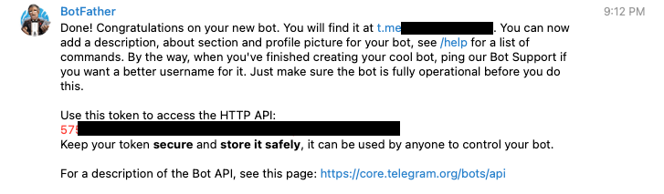
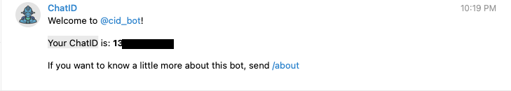

### Theo dõi trạng thái của node qua lệnh trên vps

Xem lịch sử chạy của node một cách trực quan (có màu sắc) bạn cài đặt thêm công cụ CCZE

```
sudo apt install ccze
```

Xem lịch sử chạy của node

```
journalctl -n 100 -f -u neard | ccze -A
```


### Theo dõi trạng thái của node trên website

Cài đặt

```
sudo apt install curl jq
```

Kiểm tra

```
curl -s http://127.0.0.1:3030/status | jq .version
```

Để theo dõi trạng thái của nên trên website chúng ta cần mở port 3030. Google Cloud có hệ thống firewall được quản lý trên console nên việc sử dụng firewall trên vps là không cần thiết. Vì vậy đầu tiên các bạn tắt firewall mặc định của vps sau đó sẽ mở port trên firewall của Google Cloud.

#### Tắt firewall trên vps

```
sudo ufw disable
```


#### Mở port 3030 trên firewall của Google Cloud

Trên trang console của Google Cloud bạn kích vào dấu 3 gạch -> chọn VPC network -> chọn Firewall


Kích vào " Create Firewall Rule"


Bạn điền thông tin như hình ảnh bên dưới. Sau đó kích chọn "Create"

* Name: tên của rule
* Targets: All instances in the network
* IPv4 ranges: Source filte
* Source IPv4 range: 0.0.0.0/0
* Protocols and ports: Specified protocols and ports TCP: 3030 /  UDP: 3030


Như vậy đã mở port 3030 thành công trên vps của bạn. Bạn có thể xem trạng thái của node theo đường dẫn:

http://ip_public:3030/status

http://ip_publuc:3030/debug

### Theo dõi trạng thái của node bằng bot thông báo trên Telegram

Mình sẽ hướng dẫn các bạn sử dụng script của Klesh, setup bot Telegram sẽ báo mỗi khi node của bạn có sự thay đổi như khi node ONLINE / KICKED OUT / Đang Validator … tất cả sẽ thông báo về Telegram của bạn.
"Nguồn: https://github.com/Klesh-/near-protocol-node-telegram-notifications"

Bạn cần có tài khoản teleram, việc tạo tài khoản mình không hướng dẫn vì khi tham gia vào crypto chắc chắn ai cũng có telegram rồi.

Tiếp theo bạn tạo 1 con bot cho mình trên telegram tại https://t.me/BotFather 

Bạn kích vào Start sau đó chọn /newbot nhập tên bot mà bạn muốn tạo enter. 

Khi tạo xong bot bạn hình sẽ hiển thị HTTP API và url bot của bạn mới tạo. Bạn lưu lại HTTP API



Bạn kích vào url bot của bạn và nhấn Start để cho phép bot gửi tin nhắn cho bạn

Bạn truy cập bot  https://t.me/cid_bot, kích Start. Bạn sẽ hiện thị Your ChatID, Bạn lưu lại Chat ID.



