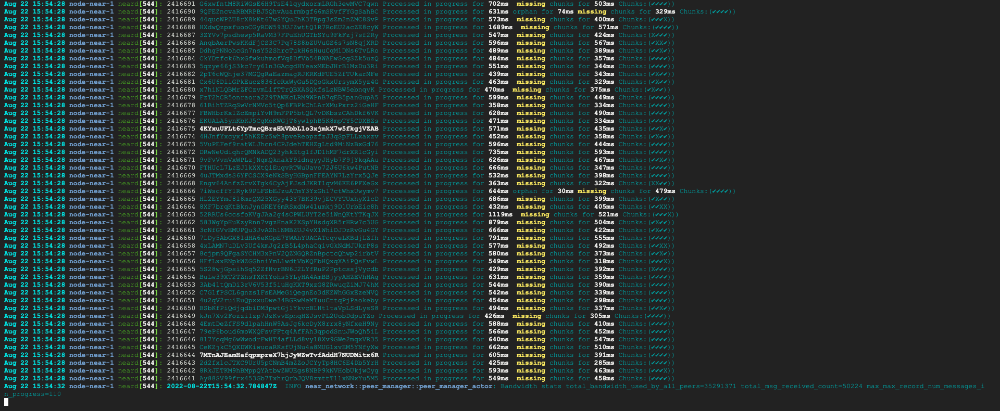
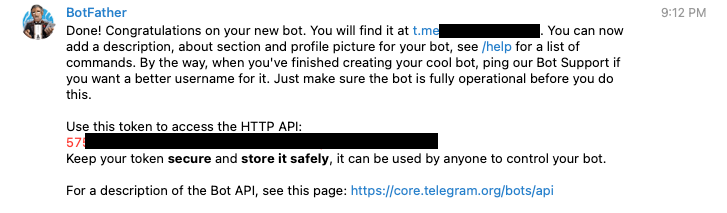
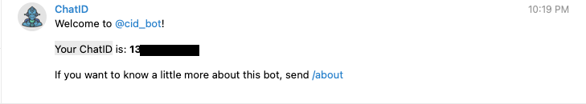
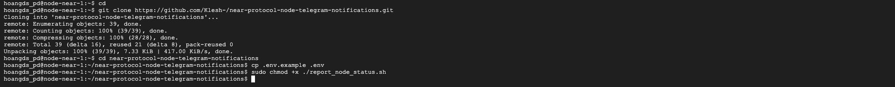
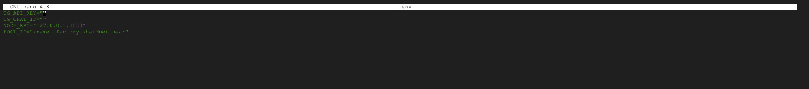
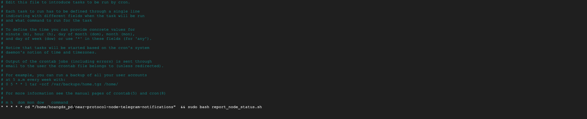

### Theo dõi trạng thái của node qua lệnh trên vps

Xem lịch sử chạy của node một cách trực quan (có màu sắc) bạn cài đặt thêm công cụ CCZE

```
sudo apt install ccze
```

Xem lịch sử chạy của node

```
journalctl -n 100 -f -u neard | ccze -A
```



Cài đặt công cụ

```
sudo apt install curl jq
```

Kiểm tra phiên bản

```
curl -s http://127.0.0.1:3030/status | jq .version
```

Kiểm tra Delegators and Stake

```
near view <your pool>.factory.shardnet.near get_accounts '{"from_index": 0, "limit": 10}' --accountId <accountId>.shardnet.near
```

Kiểm tra Reason Validator Kicked

```
curl -s -d '{"jsonrpc": "2.0", "method": "validators", "id": "dontcare", "params": [null]}' -H 'Content-Type: application/json' 127.0.0.1:3030 | jq -c '.result.prev_epoch_kickout[] | select(.account_id | contains ("<POOL_ID>"))' | jq .reason
```
Kiểm tra Blocks Produced / Expected

```
curl -r -s -d '{"jsonrpc": "2.0", "method": "validators", "id": "dontcare", "params": [null]}' -H 'Content-Type: application/json' 127.0.0.1:3030 | jq -c '.result.current_validators[] | select(.account_id | contains ("POOL_ID"))'
```

### Theo dõi trạng thái của node bằng bot thông báo trên Telegram

Mình sẽ hướng dẫn các bạn sử dụng script của Klesh, setup bot Telegram sẽ báo mỗi khi node của bạn có sự thay đổi như khi node ONLINE / KICKED OUT / Đang Validator … tất cả sẽ thông báo về Telegram của bạn.
"Nguồn: https://github.com/Klesh-/near-protocol-node-telegram-notifications"

Bạn cần có tài khoản teleram, việc tạo tài khoản mình không hướng dẫn vì khi tham gia vào crypto chắc chắn ai cũng có telegram rồi.

Tiếp theo bạn tạo 1 con bot cho mình trên telegram tại https://t.me/BotFather 

Kích vào Start sau đó chọn /newbot nhập tên bot mà bạn muốn tạo enter. 

Khi tạo xong bot màn hình sẽ hiển thị HTTP API và url bot của bạn mới tạo. Bạn lưu lại HTTP API



Kích vào url bot của bạn và nhấn Start để cho phép bot gửi tin nhắn cho bạn

Truy cập bot  https://t.me/cid_bot, kích Start. Bạn sẽ hiện thị Your ChatID, Bạn lưu lại Chat ID.



SSH vào VPS và thực hiện các lệnh sau

```
cd

git clone https://github.com/Klesh-/near-protocol-node-telegram-notifications.git

cd near-protocol-node-telegram-notifications

cp .env.example .env

sudo chmod +x ./report_node_status.sh
```


Sửa file .env

```
nano .env
```

* TG_API_KEY là HTTP API
* TG_CHAT_ID là ChatId
* {name} sửa thành id của ví của bạn



Nhấn Ctrl + O và enter để lưu file lại. Bấm Ctrl + X để thoát ra.

Đã cấu hình xong, chạy thử bằng lệnh

```
./report_node_status.sh
```

Tạo crontab để check mỗi 1 phút

```
sudo crontab -e
```

Paste cái này vào crontab

```
* * * * * cd "/home/<USER>/near-protocol-node-telegram-notifications"  && sudo bash report_node_status.sh
```
Trong đó USER là username vps của bạn
  


Nhấn Ctrl + O và enter để lưu file lại. Bấm Ctrl + X để thoát ra. Từ giờ khi có biến động liên quan đến Node bạn sẽ nhận được thông báo trên telegram.

Như vậy mình đã giới thiệu đầy đủ cho bạn 3 cách để theo dõi trạng thái của Node. Hiện tại mình đang dùng cả 3 cách này. Các bạn chọn cho mình một cách phù hợp nhé!

#### Sau khi hoàn thành việc khởi tạo một trình xác nhận bạn sẽ nhận được số điểm là 15 UNP (tương đương với 15 near được mở khoá)

