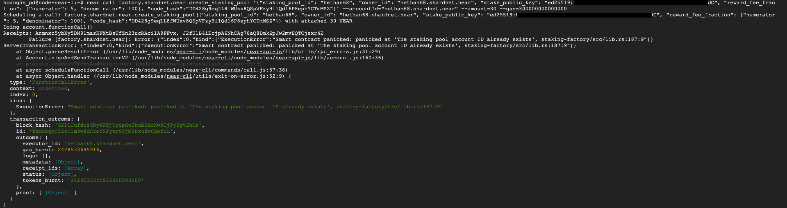
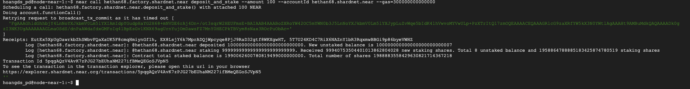

### Triển khai Staking Pool

Khởi tạo một Staking Pool với cho trình xác thực của bạn bằng cách chạy lệnh sau
```
near call factory.shardnet.near create_staking_pool '{"staking_pool_id": "<pool name>", "owner_id": "<accountId>", "stake_public_key": "<public key>", "reward_fee_fraction": {"numerator": 5, "denominator": 100}, "code_hash":"DD428g9eqLL8fWUxv8QSpVFzyHi1Qd16P8ephYCTmMSZ"}' --accountId="<accountId>" --amount=30 --gas=300000000000000
```

* Thay pool name bằng pool name của bạn
* Thay accountId bằng xxxx.shardnet.near. xxxx là địa chỉ ví của bạn
* Thay public key bằng public key được lấy trong file validator_key.json

Truy cập file validator_key.json để lấy public key
```
nano ~/.near/validator_key.json
```
  
Nếu kết quả chạy lệnh trên màn hình hiển thị có cum từ "The staking pool xxxx.factory.shardnet.near was successfully created" hoặc "The staking pool account ID already exists" có nghĩa là bạn đã tạo thành công Staking Pool của mình.
  


Hiện tại mỗi lần tạo staking pool bạn sẽ bị trừ 30 near trong ví.
  
Vì RPC của near có lúc sẽ quá tải gây ra tình trạng tạo staking pool lỗi. Nếu tạo lỗi bạn tạo lại bằng lệnh phía trên.

### Stake NEAR

near call <pool_id> deposit_and_stake --amount <amount> --accountId <accountId> --gas=300000000000000

* Thay pool_id bằng xxxx.factory.shardnet.near. xxxx là địa chỉ ví của bạn
* Thay amount bằng số lượng near bạn muốn stake
* Thay accountId bằng xxxx.shardnet.near. xxxx là địa chỉ ví của bạn
  

